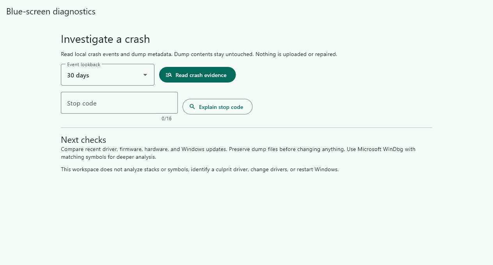
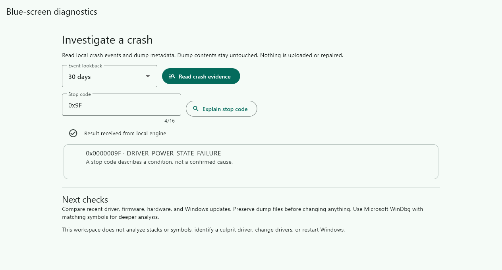
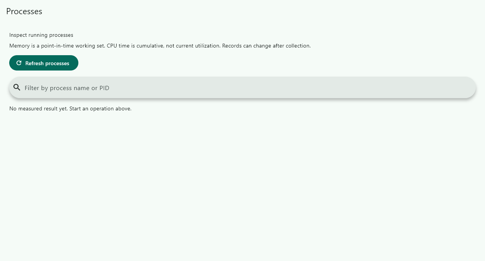
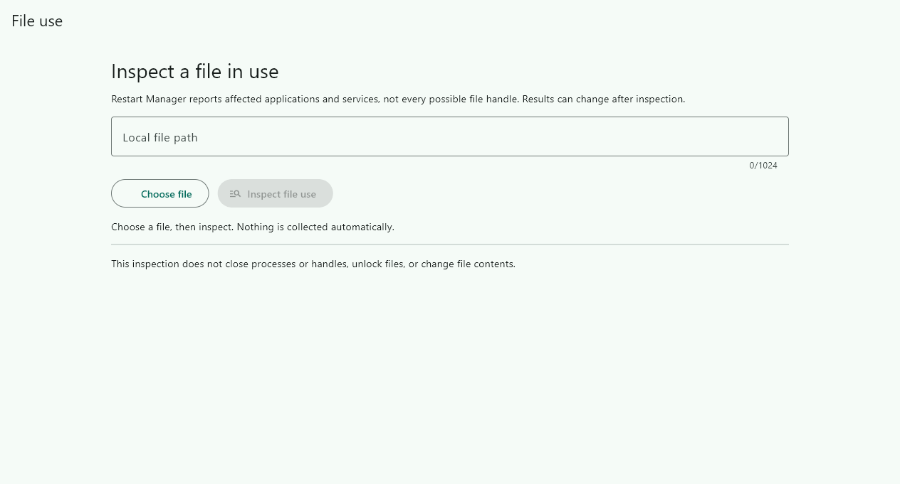

# Material System Care

Temporary-file maintenance now requires an explicit selected subset of the scanned plan. Review the exact selected paths before moving them to recovery; unchecked eligible files remain untouched. See [selected cleanup and recovery](docs/features/storage/cleanup.md) for protocol compatibility and replay limits.

Recovery history reads the receipt's recorded file details before asking to restore. Missing details block that action; restoration still checks actual identity, content and occupied destinations before moving anything.

A Windows 11 x64 maintenance and diagnostics workspace built with Flutter, .NET 10, and Material Design 3.

**Development status:** implementation is in progress. No production installer or complete feature-parity claim is available yet.

[Public documentation and capability explorer](https://ding-ding-projects.github.io/material-system-care/)

The suite combines computer health, storage analysis, application management, security integration, drivers, diagnostics, and local utilities. Operations present real targets, clear effects, and recovery information. The public website is maintained separately from the desktop workspace.

## Build

Run `build.bat /s` to build the engine, desktop, and website without launching the interface. Run `build-installer.bat /s` to produce the unsigned Squirrel.Windows package. `build.bat --run` explicitly launches the desktop after a successful build.

The entrypoints discover existing tools and obtain missing supported dependencies. They require committed source, bind receipts to the source tree and executable hashes, and propagate failed child commands. Existing-host build success is not fresh-machine installation proof. See [packaging and bootstrap limits](packaging/README.md).

Read-only storage scans support request-specific cancellation. The interface distinguishes stopping its wait from confirmation that the engine has finished, and preserves a completed result that wins the race.

The **Tools → Processes** workspace provides measured process records and an explicitly reviewed graceful-close request. A request never claims the process has exited. See [process inspection](docs/features/management/processes.md).

## Implemented development workflows

The current source provides a working foundation, with these operation families:

- Real system, volume, installed-application, startup, process, service, driver and security inventory.
- Bounded folder analysis, exact duplicate detection, age-limited temporary-file plans, recoverable quarantine and conflict-preserving restoration.
- Confirmed current-user startup changes and graceful process-close requests. Package operations require a genuine supported package identifier.
- Explicit WinGet package discovery supplies real matched identifiers for reviewed upgrade and uninstall actions, without guessing from registry names.
- Supported security scanning and driver operations with explicit elevation requirements. These have not been exercised against this host's security or drivers.
- Selected-file hashing, strict text and JSON conversion, password generation, network diagnostics and opt-in local provider access.
- [File-use inspection](docs/features/protection/file-use.md) exposes advisory Restart Manager records through an explicit read-only workspace.
- [Blue-screen investigation](docs/features/diagnostics/blue-screen.md) with provider-qualified local events, stop-code lookup and dump metadata. No root-cause certainty, dump-content analysis or automatic repair is claimed.
- Flutter Material workspaces, local appearance preferences, an operation history, contextual confirmations and honest unavailable states.

This list describes source behavior. It does not establish complete reference-product parity, runtime visual verification, or production readiness. The [versioned capability ledger](contracts/capabilities.json) retains all 295 requirements, their sources and their individual implementation states. See the [verification handoff](HANDOFF.md) for exact tested revisions and remaining gaps.

## Diagnostic workspace preview

The [interaction receipt](docs/captures/diagnostics-explained.json) binds manually entered `0x9F` and the actual explanation click to the inspected painted result. This narrow path passed; native compositor capture, dump analysis and full interaction coverage remain separate. A subsequent [private-frame collection receipt](docs/verification/diagnostic-collection.json) records actual default-period collection and one expanded event. Host-specific pixels remain private; the [receipt verifier](scripts/verify-diagnostic-collection.mjs) checks retained bytes and declared scope without replacing manual pixel review.

This is an actual painted frame from the native build at `fb128bc4acf89d9fe149150bd571c2351b91229e`, exported on an isolated desktop. Its evidence is **render-only**, not native-compositor or input verification. No diagnostic data was injected. See the [capture receipt and limitations](docs/captures/README.md).

## Project records

- [Architecture and local protocol](contracts/engine-protocol.md)
- [Feature documentation](docs/features/README.md)
- [Reference catalogue and coverage](docs/catalogue/README.md)
- [Roadmap](ROADMAP.md)
- [Handoff](HANDOFF.md)

## Status and distribution

Source and the documentation website are public. Anonymous homepage delivery, its linked assets and the 295-entry coverage data have been verified. The repository About homepage points to the exact deployed URL. Installer downloads remain unavailable until release verification is complete. This project is independently implemented and is not affiliated with IObit.

## GitHub Pages hosting

The public documentation is deployed from `website/dist` to https://ding-ding-projects.github.io/material-system-care/ by `.github/workflows/pages.yml`. The workflow invokes the root `build.bat /s --target=site` entrypoint, uses the existing pinned toolchain bootstrap, uploads the static output, and deploys with the Pages environment. It runs no tests or lint.

Relative Vite assets, metadata fetches, and the logo resolve beneath the project path. The canonical URL, sitemap, and crawler declaration use the GitHub Pages URL. The previous external deployment is historical and does not satisfy the hosting requirement. Verify the live home page, asset responses, deployment commit, and repository homepage before claiming delivery. Browser screenshots and the full desktop release remain separately unverified.

The actual filtered process-inventory path also passed a bounded hidden-input check using paced character delivery. Its runtime records remain private; the public frame below is the separate idle state. [Evidence summary](docs/verification/process-inventory.json).

Graceful-close review was also exercised against one owned disposable window: cancelling left it running, and a later inspected request was followed by independently observed absence before its timeout. [Bounded evidence](docs/verification/process-close.json). No user application was targeted.

## Process workspace frame

[Source and byte receipt](docs/captures/processes-idle.json). Actual painted production workspace on an isolated hidden desktop, render-only. No host records were collected and no process was closed.

The [File use frame receipt](docs/captures/file-use-idle.json) binds this idle painted frame to source and bundle bytes. It is render-only evidence. A separate private result frame records an owned fixture query with an advisory empty result; it is not published because it contains a local path. Native picker interaction, populated records and the complete appearance matrix remain unverified.
