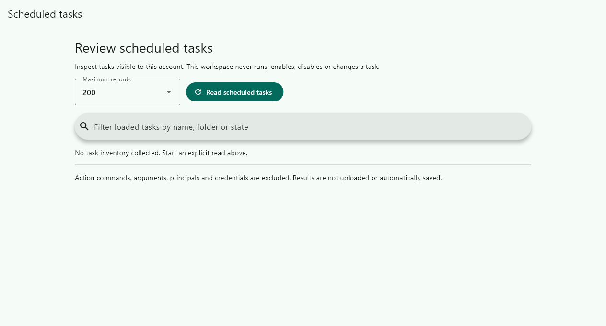
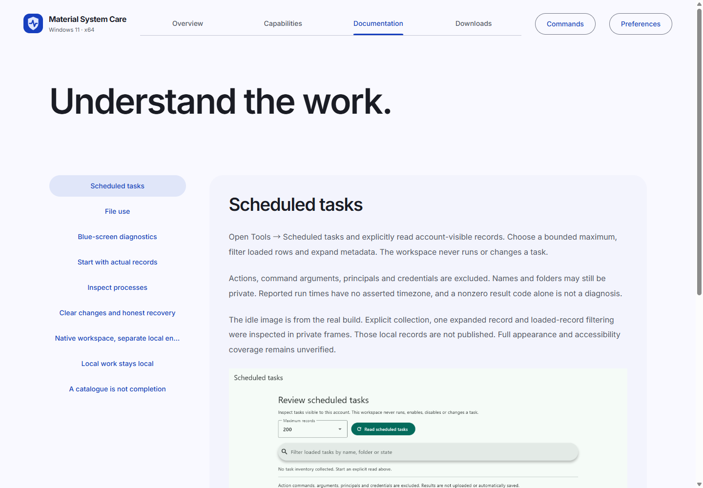
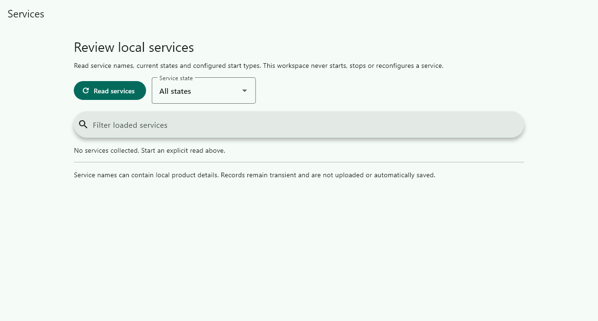
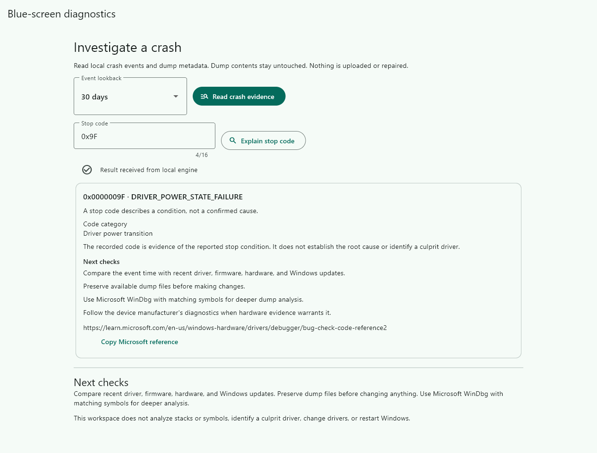

# Material System Care

## Bilingual screenshot gallery · 雙語畫面圖庫

[Forty reviewed desktop screenshots](SCREENSHOTS.md) · [Website gallery](https://ding-ding-projects.github.io/material-system-care/#/gallery) · [Complete website articles](https://ding-ding-projects.github.io/material-system-care/#/articles)

These are genuine initial viewports from the built desktop, with source and lifecycle receipts. They do not establish complete workflow or layout verification. 以上圖片來自實際桌面建置，保留來源及生命週期記錄，並不代表完整操作或全部版面已通過驗證。

Temporary-file maintenance now requires an explicit selected subset of the scanned plan. Review the exact selected paths before moving them to recovery; unchecked eligible files remain untouched. See [selected cleanup and recovery](docs/features/storage/cleanup.md) for protocol compatibility and replay limits.

Recovery history reads the receipt's recorded file details before asking to restore. Missing details block that action; restoration still checks actual identity, content and occupied destinations before moving anything.

A real [disposable cleanup/recovery round trip](docs/features/storage/cleanup-verification.md) verified selected-file movement, cancelled confirmation, conflict preservation and restoration of original bytes and identities. Its populated frames remain private because they contain local paths. The complete interface and installer lifecycle are still unverified.

The dedicated [startup review workspace](docs/features/management/startup-review.md) has a verified disposable-entry cancellation, stale-review, disable and exact restoration round trip. A separate 800×600 bilingual run verified the corrected stale-feedback message and visible review controls. These bounded checks do not establish the complete accessibility or appearance matrix.

A Windows 11 x64 maintenance and diagnostics workspace built with Flutter, .NET 10, and Material Design 3.

The typed [application and package workspace](docs/features/management/managed-packages.md) has bounded real discovery and keyboard-review evidence at 800×600 with doubled bilingual text. Paging reaches later cards, selected review actions accept keyboard activation, and explicit cancellation restores navigation. Its private inventory frames are source-bound; no package upgrade or removal was confirmed.

**Development status:** implementation is in progress. No production installer or complete feature-parity claim is available yet.

[Public documentation and capability explorer](https://ding-ding-projects.github.io/material-system-care/)

The suite combines computer health, storage analysis, application management, security integration, drivers, diagnostics, and local utilities. Operations present real targets, clear effects, and recovery information. The public website is maintained separately from the desktop workspace.

## Build

Run `build.bat /s` to build the engine, desktop, and website without launching the interface. Run `build-installer.bat /s` to produce the unsigned Squirrel.Windows package. `build.bat --run` explicitly launches the desktop after a successful build.

The entrypoints discover existing tools and obtain missing supported dependencies. They require committed source, bind receipts to the source tree and executable hashes, and propagate failed child commands. Existing-host build success is not fresh-machine installation proof. See [packaging and bootstrap limits](packaging/README.md).

Read-only storage scans support request-specific cancellation. The interface distinguishes stopping its wait from confirmation that the engine has finished, and preserves a completed result that wins the race.

The **Tools → Processes** workspace provides measured process records and an explicitly reviewed graceful-close request. A request never claims the process has exited. See [process inspection](docs/features/management/processes.md).

## Implemented development workflows

The current source provides a working foundation, with these operation families:

- Real system, volume, installed-application, startup, process, service, driver and security inventory.
- Bounded folder analysis, exact duplicate detection, age-limited temporary-file plans, recoverable quarantine and conflict-preserving restoration.
- Confirmed current-user startup changes and graceful process-close requests. Package operations require a genuine supported package identifier.
- Explicit WinGet package discovery supplies real matched identifiers for reviewed upgrade and uninstall actions, without guessing from registry names.
- Supported security scanning and driver operations with explicit elevation requirements. These have not been exercised against this host's security or drivers.
- Selected-file hashing, strict text and JSON conversion, password generation, network diagnostics and opt-in local provider access.
- [Scheduled-task review](docs/features/management/scheduled-tasks.md) provides explicit account-visible task metadata without running or changing tasks.
- [File-use inspection](docs/features/protection/file-use.md) exposes advisory Restart Manager records through an explicit read-only workspace.
- [Blue-screen investigation](docs/features/diagnostics/blue-screen.md) with provider-qualified local events, stop-code lookup and dump metadata. No root-cause certainty, dump-content analysis or automatic repair is claimed.
- Flutter Material workspaces, local appearance preferences, an operation history, contextual confirmations and honest unavailable states.

This list describes source behavior. It does not establish complete reference-product parity, runtime visual verification, or production readiness. The [versioned capability ledger](contracts/capabilities.json) retains all 295 requirements, their sources and their individual implementation states. See the [verification handoff](HANDOFF.md) for exact tested revisions and remaining gaps.

## Diagnostic workspace preview

The [interaction receipt](docs/captures/diagnostics-explained.json) binds manually entered `0x9F` and the actual explanation click to the inspected painted result. This narrow path passed; native compositor capture, dump analysis and full interaction coverage remain separate. A subsequent [private-frame collection receipt](docs/verification/diagnostic-collection.json) records actual default-period collection and one expanded event. Host-specific pixels remain private; the [receipt verifier](scripts/verify-diagnostic-collection.mjs) checks retained bytes and declared scope without replacing manual pixel review.

This is an actual painted frame from the native build at `fb128bc4acf89d9fe149150bd571c2351b91229e`, exported on an isolated desktop. Its evidence is **render-only**, not native-compositor or input verification. No diagnostic data was injected. See the [capture receipt and limitations](docs/captures/README.md).

## Project records

- [Architecture and local protocol](contracts/engine-protocol.md)
- [Feature documentation](docs/features/README.md)
- [Reference catalogue and coverage](docs/catalogue/README.md)
- [Roadmap](ROADMAP.md)
- [Handoff](HANDOFF.md)

## Status and distribution

Source and the documentation website are public. Anonymous homepage delivery, its linked assets and the 295-entry coverage data have been verified. The repository About homepage points to the exact deployed URL. Installer downloads remain unavailable until release verification is complete. This project is independently implemented and is not affiliated with IObit.

## GitHub Pages hosting

The public documentation is deployed from `website/dist` to https://ding-ding-projects.github.io/material-system-care/ by `.github/workflows/pages.yml`. The workflow invokes the root `build.bat /s --target=site` entrypoint, uses the existing pinned toolchain bootstrap, uploads the static output, and deploys with the Pages environment. It runs no tests or lint.

Relative Vite assets, metadata fetches, and the logo resolve beneath the project path. The canonical URL, sitemap, and crawler declaration use the GitHub Pages URL. The previous external deployment is historical and does not satisfy the hosting requirement. Verify the live home page, asset responses, deployment commit, and repository homepage before claiming delivery. Browser screenshots and the full desktop release remain separately unverified.

The actual filtered process-inventory path also passed a bounded hidden-input check using paced character delivery. Its runtime records remain private; the public frame below is the separate idle state. [Evidence summary](docs/verification/process-inventory.json).

Graceful-close review was also exercised against one owned disposable window: cancelling left it running, and a later inspected request was followed by independently observed absence before its timeout. [Bounded evidence](docs/verification/process-close.json). No user application was targeted.

## Process workspace frame

[Source and byte receipt](docs/captures/processes-idle.json). Actual painted production workspace on an isolated hidden desktop, render-only. No host records were collected and no process was closed.

The [File use frame receipt](docs/captures/file-use-idle.json) binds this idle painted frame to source and bundle bytes. It is render-only evidence. A separate private result frame records an owned fixture query with an advisory empty result; it is not published because it contains a local path. A subsequent [owned-holder exercise](docs/verification/file-use-holder.json) verified one populated result and its removal on refresh after the verification route released the holder. Native picker interaction, multiple/service owners and the complete appearance matrix remain unverified.

The [scheduled-task frame receipt](docs/captures/scheduled-tasks-idle.json) binds this render-only idle image to the actual producer. A separate [private runtime receipt](docs/verification/scheduled-tasks.json) records real collection, record expansion and filtering. Local task records remain private; complete appearance and accessibility coverage remains unverified.

The [live guide receipt](docs/verification/site-scheduled-tasks.json) records inspected desktop and [emulated mobile](docs/captures/site-scheduled-tasks-mobile.png) page pixels from the verified public deployment. These are partial page-level observations, not a complete accessibility or layout verdict.

Service review is available under Tools > Services with explicit collection and loaded-record filtering. See [behavior and limits](docs/features/management/services.md). Bounded real collection, expansion and filtering are evidenced; full surface verification remains incomplete.

The [service frame receipt](docs/captures/services-idle.json) binds the render-only idle image to its built source. [Private runtime evidence](docs/verification/services.json) records actual collection, expansion, text and state filtering, plus owned teardown. Complete interface coverage remains unverified.

Isolated workspace captures support [bounded language, theme, text-scale and motion overrides](docs/features/management/capture-tuples.md), without changing personal settings. Text-scale evidence does not establish physical monitor DPI.

This [isolated display-tuple receipt](docs/captures/services-yue-dark-text2.json) records an inspected idle frame. Text scale 2 does not establish physical display DPI or complete keyboard/motion coverage.

## Enlarged bilingual diagnostic preview

The complete title and lookback value are visible in this real rebuilt initial viewport. Lower content needs scrolling and is not established by this frame. See the [five-workspace evidence inventory](docs/captures/README.md#minimum-size-bilingual-inspection-workspaces) and its explicit limitations.

The [enlarged bilingual stop-code result](docs/captures/diagnostics-bilingual-explained.png) separately verifies manual 0x9F input and its completed explanation at 1264×961. The new minimum-size guide image is publicly deployed; home, script, stylesheet, image and capability data matched the local build. See [delivery proof](docs/verification/inspection-guide-delivery.json).

The diagnostic workspace now validates complete responses before accepting evidence and presents code categories, next checks, a Microsoft reference and explicit collection/modification timestamps. Rebuilt lookup and live collection passed their narrow runtime checks; copy-reference, individual dump rows and the full matrix remain unverified. Earlier captures retain their original producer identities.

[Current response-validation evidence](docs/verification/diagnostics-guidance.json) binds this real guidance view to producer 5dbf2884901cbbad61a3c763c120b19d997928e8.

## Complete documentation website · 完整文件網站

Read [all articles](https://ding-ding-projects.github.io/material-system-care/#/articles) directly on the website. The deployment at `c434189` contained 168 complete articles and a forty-image bilingual desktop gallery; all 688 deployed files matched the retained build. [Verification and limitations](docs/features/hosting/github-pages.md).

網站內可直接閱讀完整文章，毋須跳轉至 GitHub 文件。上述驗證涵蓋指定部署及部分畫面，並非整個維護套件已完成。

### Readable bilingual control labels

The current process view keeps both label lines visible at doubled text size. See [the screenshot gallery](SCREENSHOTS.md#enlarged-bilingual-control-labels) for the service and scheduled-task views and the remaining minimum-size verification limits.

目前程序畫面在雙倍文字大小下仍完整顯示雙語標籤；服務及排程工作畫面與尚待驗證的最小視窗限制，請參閱圖庫。

### Verified keyboard interaction · 已驗證鍵盤操作

[Minimum-size interaction observations · 最小視窗操作觀察](docs/features/management/keyboard-navigation.md) show Tab traversal, Page Down movement and search input in three real workspaces. These painted frames do not prove native compositor output, physical DPI or full accessibility coverage.

