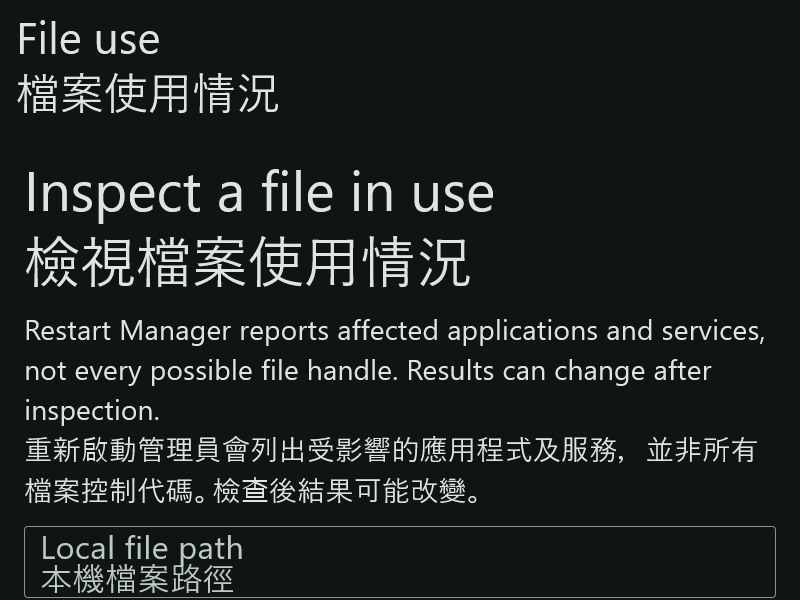
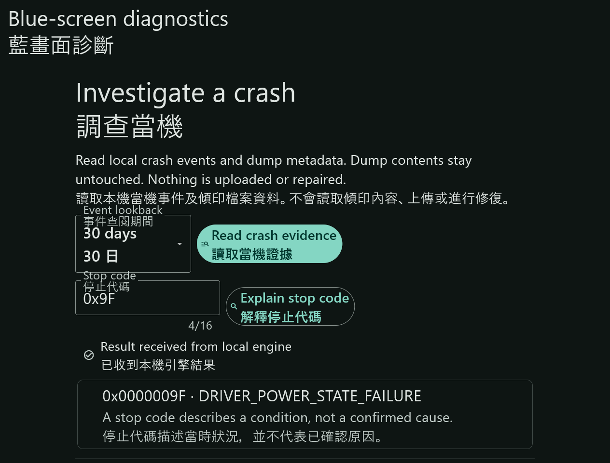

# Captured application frames

New explicit exports produce a [version-1 timing and byte receipt](../../contracts/capture-receipt.md) at `<png>.json`. It records direct render timestamps, a separate native PNG-write interval, monotonic durations, dimensions, sequence and the exact PNG hash. Success requires both files to be exclusively created and flushed. A saved PNG with an incomplete sidecar is retained and reported as incomplete. These receipts do not establish native-compositor capture, physical display DPI, source provenance or visual correctness by themselves. Historical frames below retain their documented unknown capture times; no time is inferred from file modification dates.

| ID | Producer | Scope | State |
| --- | --- | --- | --- |
| `diagnostics-idle-en-light-1264x681` | `cfa86ebb78312984a90ccd26b814f4a4d00a58e9` | Actual painted Flutter frame, render-only | Diagnostic workspace, idle, English, light, 1264 × 681, scale 1 |

[Source and byte receipt](diagnostics-idle.json). The built native application ran on an isolated Lowlevel desktop with default preferences. The original PNG is retained unchanged. It is not a mock or reconstructed interface, but neither is it a native-compositor screenshot. The separate stop-code interaction below passed. Live event collection and the complete layout matrix are not established by these frames. The exact capture instant is unavailable; the receipt records a separately observed time.

`scripts/verify-render-frame.mjs` validates this narrow alternative route against the original owned run, producer receipt, current built bundle, PNG bytes, privacy declarations and teardown record. It does not pass the separate native-window evidence gate or change any capability to fully runtime-verified.

## Observed stop-code interaction

[Interaction receipt](diagnostics-explained.json): source `cfa86ebb78312984a90ccd26b814f4a4d00a58e9`, English, light, 1264 × 681, scale 1. Lowlevel background input entered `0x9F` and clicked the real explanation button. The inspected painted frame shows `0x0000009F · DRIVER_POWER_STATE_FAILURE` and a completed local-engine response. No crash-history collection or dump read ran. Source, bundle, raw PNG, input/child receipts and owned teardown are retained. Run the same validator with its optional fourth argument `explained`. It checks byte and receipt consistency; it cannot replace pixel inspection or prove a full input matrix.

## Process workspace

[Receipt](processes-idle.json): source `a9975e2d639f0fe37b4fc3c699ad05f9df2a2aee`, English, light, 1264 × 681, scale 1. Actual idle painted frame with isolated default preferences. No process collection, close action or injected records. The owned desktop and both producer executables were confirmed absent after teardown. Validate with the fourth argument `processes-idle`; native compositor and interaction evidence remain separate.

## Minimum-size bilingual inspection workspaces

Root engine and desktop builds passed at eeaf858395cf171291faa31d0d85c3de206fdb4b. Five real idle workspaces were inspected at an 800×600 client area, English/Cantonese bilingual mode, dark theme, text scale 2 and requested reduced motion. All five complete titles are visible. Content extends below the viewport; these frames do not prove the lower controls, popups, full keyboard flow, physical DPI or motion. Background Page Down did not scroll the service view. Exact bundle processes were absent and all five owned desktops closed. The route used compatibility HTTP/native C++ with identity-checked native resizing and unchanged Flutter painted output, not native compositor capture. See docs/verification/inspection-minimum.json.

### services

ID: `services-minimum-bilingual`. Producer: `eeaf858395cf171291faa31d0d85c3de206fdb4b`. Initial viewport only; dark, bilingual, text scale 2, 800×600. SHA-256: `5169ffc58363e0b01fa7b07c4d686c1ee59665f6077751323842aa0cea95b4d4`.

### diagnostics

ID: `diagnostics-minimum-bilingual`. Producer: `eeaf858395cf171291faa31d0d85c3de206fdb4b`. Initial viewport only; dark, bilingual, text scale 2, 800×600. SHA-256: `abf66f45d838f7b15d945fcc3aa4c1767a60fe4cfa9faaf466f69fe6bfd438e7`.

### processes

ID: `processes-minimum-bilingual`. Producer: `eeaf858395cf171291faa31d0d85c3de206fdb4b`. Initial viewport only; dark, bilingual, text scale 2, 800×600. SHA-256: `9577d7bdfeff2c239758643bc2337dca2f8ac0b9e2bf4f2aaf02874f835cd074`.

### file-use

ID: `file-use-minimum-bilingual`. Producer: `eeaf858395cf171291faa31d0d85c3de206fdb4b`. Initial viewport only; dark, bilingual, text scale 2, 800×600. SHA-256: `5b4261ab53522a1776424e858f6566bd0acaa0792de3da4d6bcea55047d8fa66`.

### scheduled-tasks

ID: `scheduled-tasks-minimum-bilingual`. Producer: `eeaf858395cf171291faa31d0d85c3de206fdb4b`. Initial viewport only; dark, bilingual, text scale 2, 800×600. SHA-256: `2870499d2fb9992e7b5f56b0c18134fac5476be695d864322aea9af8b6b37adc`.

[Shared source, byte and teardown receipt](../verification/inspection-minimum.json). Run `scripts/verify-inspection-minimum.mjs` with the repository and retained matrix run. Exact capture time is unavailable.

## Enlarged bilingual stop-code interaction

ID: `diagnostics-bilingual-explained`. A second real run at producer eeaf858395cf171291faa31d0d85c3de206fdb4b verified manual 0x9F entry and a completed DRIVER_POWER_STATE_FAILURE explanation in bilingual mode, dark theme and text scale 2. The complete result was inspected at 1264×961 after resizing the same owned hidden window. It did not collect crash history or read dump contents. A background wheel message was accepted without visible scrolling, so no scroll verification is claimed. The exact bundle processes were absent and the owned desktop closed. The original rejected reuse attempt changed only an unreferenced launch-result log; all previously published evidence hashes still passed. The new run uses independent saved state.

[Source and input receipt](../verification/diagnostics-bilingual-explained.json). SHA-256: `de2c7048bf0a3e3393c41485c1fc4213a3182e8137f584f0d811093b55312af0`. Exact capture time is unavailable. `scripts/verify-diagnostics-bilingual.mjs` validates retained input and byte consistency; it does not replace pixel review.

## Validated diagnostic guidance

Producer `5dbf2884901cbbad61a3c763c120b19d997928e8`, English/light, text scale 1, 1264×961. Real 0x9F input produced the full guidance. A subsequent private frame verified successful live collection and visible collection-time meaning. The copy-reference action and individual dump rows were not exercised. Owned processes were absent and the desktop closed. [Receipt](../verification/diagnostics-guidance.json). Verify with `scripts/verify-diagnostics-bilingual.mjs` and fourth argument `guidance`. Exact capture time is unavailable.
