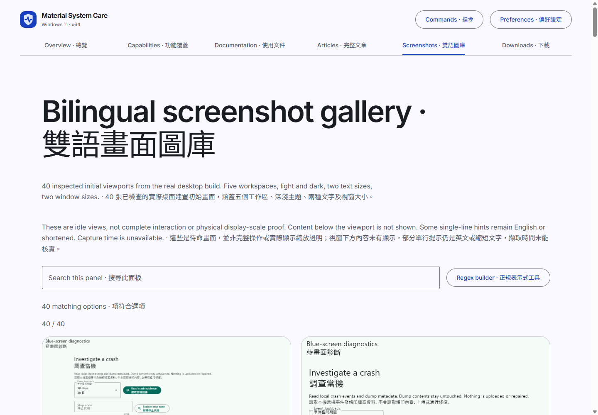
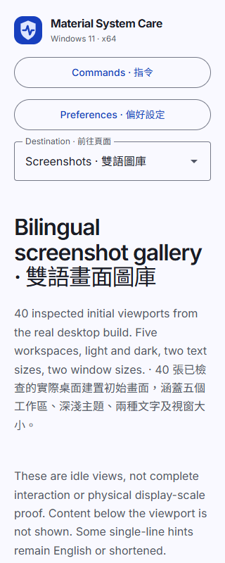
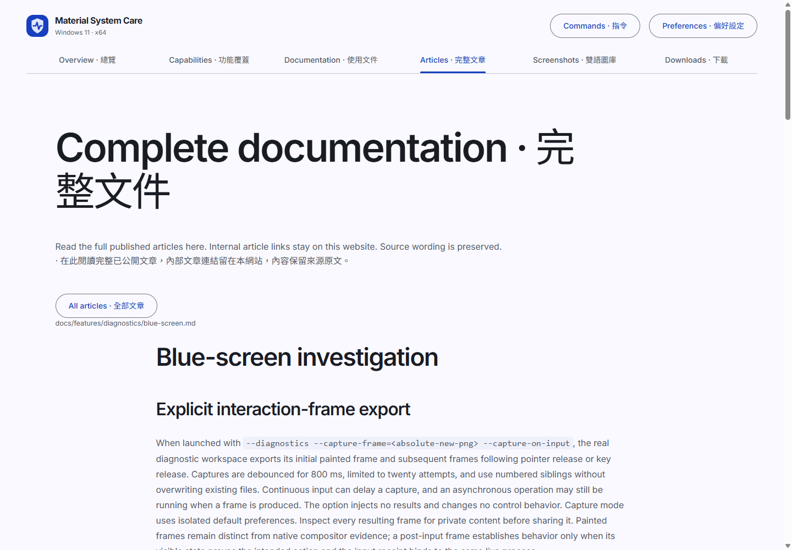
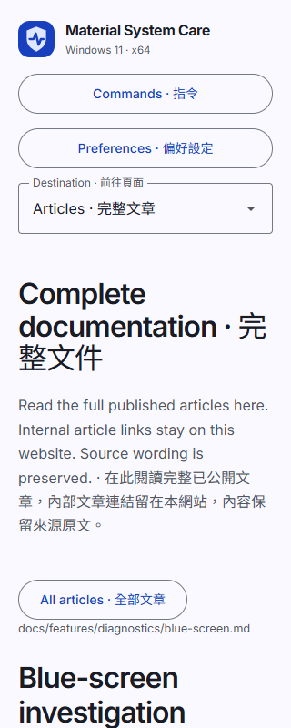

# Public documentation deployment

## Verified article and gallery delivery

Deployment `38020360091` published source `c434189d5398365670d8aee4cbe2cc1e9d17fd6a`. All 688 retained deployment files returned matching bytes, including 168 complete article pages and all forty desktop gallery images. The compiled articles contained 192 internal article links and anchors with no missing target. The About homepage was read back as the exact public home URL.

Live isolated Edge checks covered the gallery, the diagnostic article reader and its prerendered URL at 1440×1000, 390×844 and 320×800. The retained representative frames below had no body overflow, relevant console/resource failures or unnamed visible controls. These are sampled light-theme bilingual interface checks, not full theme, scaling, keyboard, motion or accessibility certification. Article text retains its published source language. Browser processes and debugging listeners exited; private profiles remain in the evidence inventory.

Evidence: [website delivery receipt](../../verification/website-articles-gallery.json). `scripts/verify-website-gallery-evidence.mjs` checks retained image/receipt identities. `scripts/verify-published-docs.mjs` compares every deployed file to an exact retained build; an intentionally mismatched file was rejected. Local versus hosted text line endings differed, so the successful delivery comparison used the exact hosted build rather than silently normalizing hashes.

### 已驗證交付

正式部署的 688 個檔案均與保留的部署輸出一致，包括 168 篇完整文章及四十張桌面圖庫圖片。192 個內部文章連結及錨點均有目標。隔離瀏覽器亦檢查了桌面、390 及 320 像素畫面；這只是部分淺色雙語介面的驗證，並非完整主題、縮放、鍵盤或無障礙認證。文章保留原有語言，Wiki 端點仍未能使用。

## Complete articles and bilingual gallery

The website has an internal complete-article reader at `#/articles` and a forty-image bilingual gallery at `#/gallery`. The build indexes tracked Markdown, excluding agent instructions and hosting administration files, preserves full article content, sanitizes active HTML, and rewrites relative article links to internal routes. It also emits a prerendered HTML copy of every article. Local documentation images and evidence files are copied from tracked public sources, never private capture directories.

GitHub source links are optional references, not substitutes for reading articles. The wiki Git endpoint currently reports that the repository is unavailable; no wiki import is claimed. If a separate wiki becomes available, its complete reviewed content must be mirrored into this website before claiming synchronization.

The gallery contains only bilingual initial desktop viewports. Its complete inventory, source binding, limitations and original image links are in `SCREENSHOTS.md` and `docs/captures/gallery.json`. A thumbnail or gallery image does not establish complete interaction, accessibility, physical display scaling or absence of layout defects elsewhere.

## 完整文章及雙語圖庫

網站內提供完整文章閱讀器及四十張雙語畫面圖庫。建置會保留已追蹤 Markdown 的完整內容、移除可執行 HTML，並將內部文章連結留在網站內，亦輸出預先呈現的 HTML。GitHub 只作可選原始碼參考，不能代替文章內容。Wiki 端點目前未能使用，沒有宣稱已同步。圖庫屬初始待命畫面，並非完整操作或全部版面驗證。

## GitHub Pages hosting

The public documentation is deployed from `website/dist` to https://ding-ding-projects.github.io/material-system-care/ by `.github/workflows/pages.yml`. The workflow invokes the root `build.bat /s --target=site` entrypoint, uses the existing pinned toolchain bootstrap, uploads the static output, and deploys with the Pages environment. It runs no tests or lint.

Relative Vite assets, metadata fetches, and the logo resolve beneath the project path. The canonical URL, sitemap, and crawler declaration use the GitHub Pages URL. The previous external deployment is historical and does not satisfy the hosting requirement. Verify the live home page, asset responses, deployment commit, and repository homepage before claiming delivery. Browser screenshots and the full desktop release remain separately unverified.
